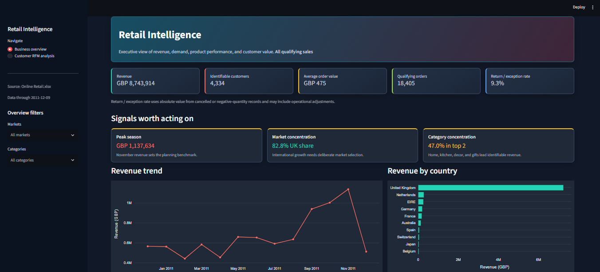
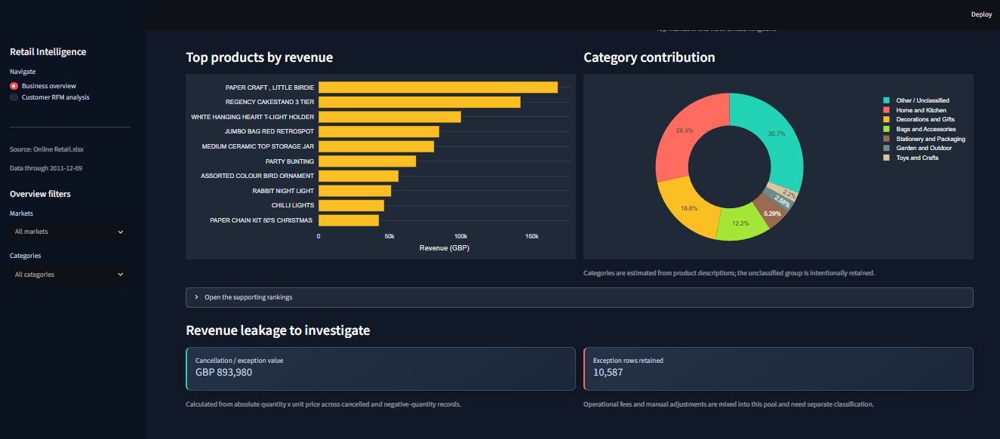
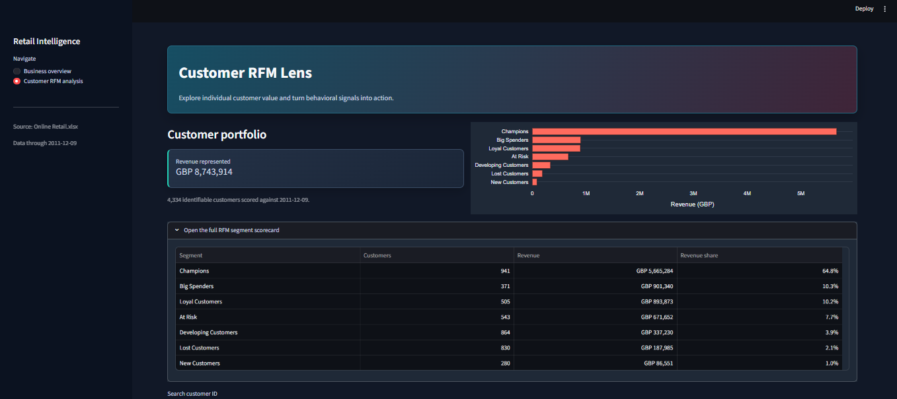
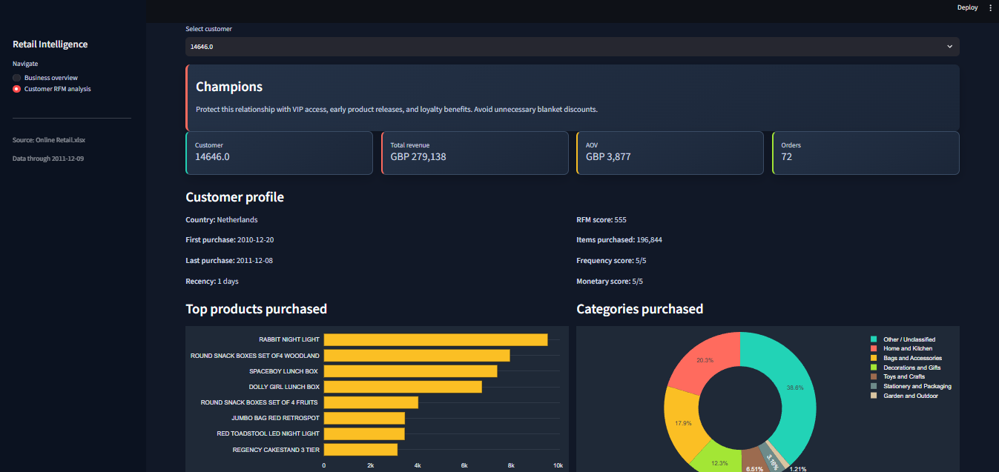

<div align="center">

# 🛍️ Retail Intelligence Dashboard

### Turning online retail transactions into clear, actionable business insight

<p>
	<strong>Python</strong> · <strong>pandas</strong> · <strong>Plotly</strong> · <strong>Streamlit</strong> · <strong>RFM Analysis</strong>
</p>

</div>

<p align="center">
	
</p>

## ✨ Project Overview

This project explores the Online Retail dataset and turns raw transaction records into an interactive analytics dashboard. It covers data cleaning, revenue trends, product performance, market analysis, estimated categories, returns and exceptions, and customer segmentation using RFM analysis.

The dashboard is designed for a business user who wants to answer questions such as:

- Which markets generate the most revenue? 🌍
- When does demand peak? 📈
- Which products and categories deserve attention? 🛒
- Which customers are champions, loyal, new, at risk, or lost? 👥
- How large are the cancellation and return exceptions? ⚠️

## 📊 Key KPIs

| KPI | Result | Meaning |
|---|---:|---|
| 💷 Cleaned revenue | **GBP 8,743,913.64** | Revenue from qualifying merchandise sales |
| 🧾 Qualifying transaction rows | **391,286** | Rows remaining after cleaning and sales filters |
| 👥 Identifiable customers | **4,334** | Customers with usable `CustomerID` values |
| 🛍️ Cancelled or returned rows | **10,587** | Exception rows retained for separate analysis |
| 🇬🇧 UK revenue share | **82.8%** | Revenue concentration in the United Kingdom |
| 📅 Strongest complete month | **November 2011** | Approximately GBP 1.14 million in revenue |
| 📦 Top two identifiable categories | **47.0%** | Home, kitchen, decoration, and gift concentration |
| ⚠️ Exception value | **Approximately GBP 893,980** | Absolute value of cancellation and return records |

> **Important:** This project measures revenue, not profit. Product cost and margin data are not available in the source workbook.

## 🖥️ Dashboard Pages

### 1. Business Overview

- Revenue, customers, average order value, orders, and exception rate KPI cards
- Market and category filters
- Monthly revenue trend
- Revenue by country
- Top products by revenue
- Estimated category contribution
- Supporting rankings and revenue leakage review

### 2. Customer RFM Lens

- Customer portfolio and segment revenue
- Search by customer ID
- Customer value, AOV, order count, and RFM score
- Segment-specific recommendations
- Top products and categories purchased
- Individual customer purchase rhythm

## 🖼️ Dashboard Preview

### Business overview and KPI cards

<p align="center">
	
</p>

### Product and category performance

<p align="center">
	
</p>

### Customer RFM portfolio

<p align="center">
	
</p>

### Individual customer analysis

<p align="center">
	
</p>

## 🚀 Run the Dashboard

### Prerequisites

- Python 3.10 or newer
- The source workbook named `Online Retail.xlsx` in the project folder
- PowerShell, Command Prompt, or an equivalent terminal

### 1. Clone or open the project

```powershell
git clone <your-repository-url>
cd AI-Powered-Retail--Data-Analysis
```

### 2. Create a virtual environment

```powershell
python -m venv .venv
.\.venv\Scripts\Activate.ps1
```

### 3. Install dependencies

```powershell
python -m pip install --upgrade pip
python -m pip install pandas openpyxl matplotlib plotly streamlit jupyter
```

### 4. Start the dashboard

```powershell
python -m streamlit run app.py
```

Streamlit will display a local URL, usually:

```text
http://localhost:8501
```

Open that address in a browser and use the sidebar to switch between **Business overview** and **Customer RFM analysis**.

To use another port:

```powershell
python -m streamlit run app.py --server.port 8502
```

## 📚 Project Files

| File | Description |
|---|---|
| [`app.py`](app.py) | Streamlit dashboard and analysis pipeline |
| [`RetailDataAnalysis.ipynb`](RetailDataAnalysis.ipynb) | Main cleaning, sales, product, country, category, return, and demand analysis |
| [`RFM_Customer_Analysis.ipynb`](RFM_Customer_Analysis.ipynb) | Customer scoring and RFM segmentation |
| [`Important_Analysis_Summary.md`](Important_Analysis_Summary.md) | Executive findings, recommendations, and limitations |
| [`Images/`](Images/) | Dashboard screenshots |

## 🧹 Data Preparation

The pipeline:

1. Loads the Excel workbook with pandas.
2. Standardizes IDs, dates, quantities, and prices.
3. Removes exact duplicate rows.
4. Flags cancelled invoices and negative-quantity returns.
5. Keeps exception rows separately for operational review.
6. Removes missing required values and invalid sales records.
7. Excludes non-product codes such as postage, fees, and manual adjustments.
8. Calculates `Revenue = Quantity × UnitPrice`.
9. Aggregates results by month, country, product, category, and customer.

## 🧠 RFM Explained

RFM ranks customers using three behavioral signals:

- **Recency:** how recently the customer purchased.
- **Frequency:** how many distinct invoices the customer has.
- **Monetary value:** how much qualifying revenue the customer generated.

The resulting segments are **Champions**, **Loyal Customers**, **Big Spenders**, **New Customers**, **At Risk**, **Lost Customers**, and **Developing Customers**.

## 💡 Main Business Insights

- The United Kingdom contributes **82.8%** of cleaned revenue.
- November is the strongest complete month, so inventory and staffing should be planned before the autumn demand increase.
- A small group of high-value customers contributes a large share of revenue and deserves retention attention.
- Home and Kitchen plus Decorations and Gifts represent approximately **47%** of identifiable category revenue.
- Bulk transactions should be audited before being used for ordinary demand forecasting.
- Product cost data is needed before making profitability or margin decisions.

## ⚠️ Analysis Limitations

- Product categories are inferred from description keywords because the source has no official category field.
- December 2011 is incomplete because the data ends on 9 December.
- Large bulk orders can distort product and customer rankings.
- Customer analysis excludes transactions without a usable `CustomerID`.
- Profit and margin cannot be calculated without cost-of-goods data.
- Cancellation, return, fee, and manual-adjustment records require additional business classification.

## 🔗 Useful Links

- [Streamlit documentation](https://docs.streamlit.io/)
- [pandas documentation](https://pandas.pydata.org/docs/)
- [Plotly Python documentation](https://plotly.com/python/)
- [Jupyter documentation](https://docs.jupyter.org/)

## 👤 Beginner-Friendly Learning Path

1. Read [`Important_Analysis_Summary.md`](Important_Analysis_Summary.md) for the business story.
2. Run [`RetailDataAnalysis.ipynb`](RetailDataAnalysis.ipynb) to understand cleaning and exploratory analysis.
3. Run [`RFM_Customer_Analysis.ipynb`](RFM_Customer_Analysis.ipynb) to understand customer segmentation.
4. Start [`app.py`](app.py) and interact with the dashboard filters.
5. Compare dashboard values with the notebook calculations.

---

<div align="center">

**Built for practical retail analytics, clear communication, and better decisions.** 📈

</div>
